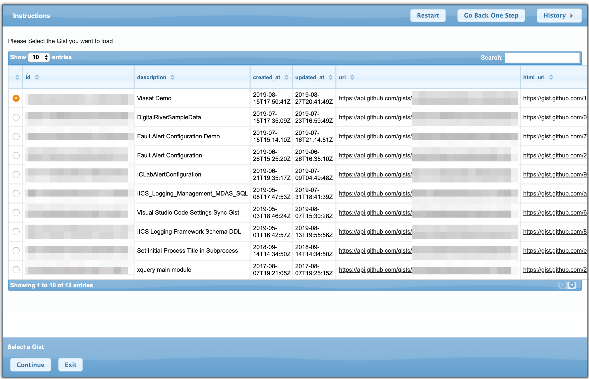

# Uncaught Fault Alert Service Implementation

This project contains Informatica IICS CAI Fault alert Service Implementation.
Provided Service allows to apply declarative Alert Rules and flexible framework to use any of the built-in or custom Actions

UncaughtFaultAlertHandler Process riweuri


<!-- TOC -->

- [Uncaught Fault Alert Service Implementation](#uncaught-fault-alert-service-implementation)
  - [Features](#features)
  - [Overview](#overview)
  - [Installation](#installation)
    - [Pre-Requisites](#pre-requisites)
      - [Setup GitHub Gist Account and Access Token](#setup-github-gist-account-and-access-token)
      - [Setup GitLab Account and Access Token](#setup-gitlab-account-and-access-token)
    - [Build and Install the Package](#build-and-install-the-package)
      - [Inspect and adjust Main build.properties configuration file](#inspect-and-adjust-main-buildproperties-configuration-file)
      - [Configure credentials file](#configure-credentials-file)
    - [Transformation Properties](#transformation-properties)
      - [Example Transformation Properties File](#example-transformation-properties-file)
      - [Main Ant Script Properties](#main-ant-script-properties)
      - [Ant Build Script](#ant-build-script)
    - [Build Package From Source](#build-package-from-source)
      - [In Process Developer](#in-process-developer)
      - [Example package.src Script output](#example-packagesrc-script-output)
      - [On Command Line](#on-command-line)
    - [Configure Your Org](#configure-your-org)
      - [URN mappings](#urn-mappings)
      - [Set Alert Service](#set-alert-service)
    - [Pre-built Distribution](#pre-built-distribution)
  - [Alert Service Components](#alert-service-components)
    - [Process Objects](#process-objects)
  - [Setup Gist Connector and Connection](#setup-gist-connector-and-connection)
  - [Fault Alert Handler Configuration](#fault-alert-handler-configuration)
    - [Supported Condition Types](#supported-condition-types)
    - [Supported Actions](#supported-actions)
    - [Alert configuration Management tool](#alert-configuration-management-tool)
    - [Alert Service Testing Tool - Testing Configuration](#alert-service-testing-tool---testing-configuration)
  - [Extending Alert Service](#extending-alert-service)
    - [Add Custom Action](#add-custom-action)
    - [Add Custom Configuration Storage Provider](#add-custom-configuration-storage-provider)
    - [Known Issues](#known-issues)
  - [Glossary of Terms used in this Documents](#glossary-of-terms-used-in-this-documents)

<!-- /TOC -->

## Features

- Declarative extensible configuration providers (currently supports github gist, http(s) get, local file)
- Declarative rules to route message to specific actions with flexibility to add custom actions (event triggers via JMS,AWS SQS, Kafka)
- Declarative Actions currently supported
    - ignore
    - alert-email
- Ability to Save/read configuration in xml on simple http get provider or github gist or similar snippet storage
- Other configuration storage and action providers should be possible to develop via ICAI Service Connectors
- Guide based configuration manager

## Overview

The Alert Service is available for processes that run on a Secure Agent or the Cloud Server. Alert Service provides a mechanism
to send alert notifications via built-in email notification service or define custom Alert Handler Process.

This project is also a good example how to maintain, build and deploy Informatica IICS project with automation and version control and help of
IICS Asset Management CLI V2 Utility

> See [Alert Service Documentation][alert_service_help]
> See [IICS Asset Management CLI V2 Utility][iics_cli]

## Installation

### Pre-Requisites

It is highly recommend to use the build from source as it allows you to change certain attributes of service deployment such as target Secure agent group, etc.
To build and install from source, you'll need a following set of tools

- git client installed on your system
- Java 1.8 or higher installed on the System
- Apache Ant 1.9 or higher installed on the system or use Informatica Process Developer which includes Ant runtime
- Informatica Process Developer

You can follow this guide [Set Development Environment for IPD Development][development_setup] to setup your environment

> See Guide to [Install Process Developer][ipd_install_guide]

In Order to Setup this Service after Deployment of assets Storage providers all provided Storage provider Connectors and Connections must be configured.
You can Select One of the Supported providers (GitHub, GitLab) And configure it with corresponding access token. The other unused providers must be still published, but can be published with empty credentials.
Follow the below steps for setting Storage Provider Accounts 

#### Setup GitHub Gist Account and Access Token

Make sure your secure agents can access the GitHub API to store and retrieve the Alert Service configuration file.

This Alert Service Implementation can use Github Gist (both Cloud and On premise Github Enterprise Edition) as a storage for its configuration
It is recommended to use private gist to store this configuration, you will need to create Security token to access private gists via API

1. Login to Github with an account that would be owner of the configurations (this should be likely service Account or account managed by IT Infrastructure administrators)
2. Go to [Account Settings/Developer Settings/Personal access tokens](https://github.com/settings/tokens)
3. Create new token and give it descriptive name such as `IICS-Configuration-Gist-Access`
4. Select only gist permission

    

5. Capture generated token and save it in a save location for later use in the Service Connector configuration after Deployment of the IICS package

    

#### Setup GitLab Account and Access Token

Make sure your secure agents can access the GitLab API to store and retrieve the Alert Service configuration file.

This Alert Service Implementation can use Cloud Hosted or on-premise GitLab as a storage for its configuration
It is recommended to use private snippets to store this configuration, you will need to create Security token to access private Assets via API

1. Login to GitLab with an account that would be owner of the configurations (this should be likely service Account or account managed by IT Infrastructure administrators)
2. Go to [Account Settings/Access Tokens](https://gitlab.com/profile/personal_access_tokens)
3. Create new token and give it descriptive name such as `IICS-Configuration-API-Access`
4. Optionally set expiration date
5. Select api access permission

    

6. Capture generated Token and use it to configure GitLab Service Connector

### Build and Install the Package

Fork and clone this repository

Following is a clone command example, use your own repository url if you have forked this repository.

```shell
git clone git@github.com:jbrazda/icai-fault-alert-service.git
```

#### Inspect and adjust Main build.properties configuration file

Main configuration file defines key modules locations and enables/disables supporting Tools maintained externally as a dependency.

Example main Configuration file (build.properties) 

```properties
# lib path
tools.lib=${basedir}/target/lib

#IICS Asset Management CLI
# See https://network.informatica.com/docs/DOC-18245
tools.iics.mac=${tools.lib}/iics
tools.iics.linux=${tools.lib}/iics
tools.iics.win.x86=${tools.lib}/iics.exe
tools.iics.win.amd64=${tools.lib}/iics.exe

## url.download.iics - OS Specific URL
url.download.iics.mac=https://github.com/InformaticaCloudApplicationIntegration/Tools/raw/master/IICS%20Asset%20Management%20CLI/v2/mac-x86_64/iics
url.download.iics.win=https://github.com/InformaticaCloudApplicationIntegration/Tools/raw/master/IICS%20Asset%20Management%20CLI/v2/win-x86_64/iics.exe
url.download.iics.win.x86=https://github.com/InformaticaCloudApplicationIntegration/Tools/raw/master/IICS%20Asset%20Management%20CLI/v2/win-i386/iics.exe
url.download.iics.linux=https://github.com/InformaticaCloudApplicationIntegration/Tools/raw/master/IICS%20Asset%20Management%20CLI/v2/linux-x86_64/iics

## URLs to Download IICS Migration and Reporting Tools Modules
url.download.iics.tools.transform.archive=icai_migration_tools.zip
url.download.iics.tools.transform=https://raw.githubusercontent.com/jbrazda/icai-migration-tools/master/dist/${url.download.iics.tools.transform.archive}
url.download.iics.tools.reporting.archive=v1.1.zip
url.download.iics.tools.reporting=https://github.com/jbrazda/iics-reporting-tools/archive/${url.download.iics.tools.reporting.archive}

## Direstoriess for IICS Tools Module Installations
iics.tools.dir.reporting=${tools.lib}/reporting
iics.tools.dir.transform=${tools.lib}/transform

## Defines directory used for Downloads
tools.download.dir=${user.home}/Downloads

## IICS Script tool Modules
tools.package.transform=${iics.tools.dir.transform}/build.xml
tools.package.reporting=${iics.tools.dir.reporting}/build.xml

#Disable Use of Individual Modules
tools.reporting.disabled=false
tools.transform.disabled=false

## Configure your IICS org region. For example, us, eu, ap
iics.region=us

# these properties are for future use (nbit used at this time)
saxon.lib=${basedir}/target/lib
saxon.class=org.activebpel.rt.bpel.ext.expr.impl.xquery.AeQuery
```

#### Configure credentials file

Example file is listed below.
recommended location is your home directory/iics `~/iics/environment.properties` as it will contain sensitive information.
I would also recommend to create Native IICS Service user in each of your orgs that can be used to export/import resources via IICS REST API using the [IICS Asset Management CLI][iics_cli]
This tool will automatically download latest version an use it to import provided service to your target org

```properties
# This file should contain properties for Each environment
# defined in the associated release properties file property iics.environment.list
#  
# DEV Environment Credentials
iics.user.dev=deployer-iics-dev@acme.com
iics.password.dev=SET_PASSWORD

# TEST Environment Credentials
iics.user.test=deployer-iics-test@acme.com
iics.password.test=SET_PASSWORD

# PROD Environment Credentials
iics.user.prod=deployer-iics-prod@informatica.com
iics.password.prod=SET_PASSWORD
```

> WARNING Never put these properties into the project folder and keep this property file in a secure location ideally  `~/iics/environment.properties` The `~/iics` folder should be accessible only by user running the import/export/publish tasks (use '700' permission on unix systems)

Update existing or copy [conf/iics.release.properties](conf/iics.release.properties) file which defines a key Environment specific parameters

```properties
# define a comma separated list of environment org labels such as 
# dev,test,uat,prod
iics.environment.list=dev,test,prod

# This property points to file which contains credentials to login to individual environments
# and other environment Specific properties
# we recommend to use ${user.home}/iics protected directory
# never commit this file to version control with this project as it contains credentials to your IICS Orgs
# the iics.external.properties must contain set of properties 
# following this naming convention for each environment defined in the iics.environment.list
# iics.user.${environment}=
# iics.password.${environment}=
# iics.transform.properties.${environment}=
iics.external.properties.dir=${user.home}/iics
iics.external.properties=${iics.external.properties.dir}/iclab.properties

# this query is used by iics list command to retrieve available sources from repository 
# to extract the designs from IICS
# see https://network.informatica.com/docs/DOC-18245#jive_content_id_List_Command
iics.query=-q "location==Alerting"

# Defines the output file for the list command 
# the output location will be driven by the following expression
# ${basedir}/target/${selected.release.basename}/export/${iics.source.environment}/${iics.list.output}
iics.list.output=export_list.txt

# Defines the output file name for iics export command
# the output location will be driven by the 
# ${basedir}/target/${selected.release.basename}/export/${iics.source.environment}/${iics.export.output}
iics.export.output=FaultAlertService.zip

# Defines Output File name without extension
# the package.src will produce file in the location based on following expression
# ${iics.package.output}_${iics.release.basename}_${iics.target.package.config.basename}.zip
iics.package.output=FaultAlertService

# Defines Extract output directory for iics extract command
iics.extract.dir=${basedir}/src/ipd

# Defines transform directory used to copy sources from iics.extract.dir to allow pre-processing and source transformations before package.src target is called
transform.src.folder=${basedir}/target/transform/src
# Defines temporary folder used by transformation pre-processing steps such as set suspend on fault
transform.temp.folder=${basedir}/target/transform/temp
```

### Transformation Properties

Often some on-the-fly Design transformations may be desired to simplify deployment steps and automate some migration changes to deployed designs
These include following types of changes

- Migrate process from Cloud to specific Secure Agent or Agent Group
- Migrate process from Agent to Cloud
- Set Process Tracing levels
- Set Process Suspend on Fault

This set of build scripts contains optional Scripts Module Which contains set of xslt scripts which can be applied to selected designs before packaging and deployment/import to target org
This module is maintained in a separate github project [icai-migration-tools](https://github.com/jbrazda/icai-migration-tools) Script will automatically download migration tools and run the transformations steps.

When you want to use this optional step of build and deployment you will need to specify `transform.properties` which configures which transformation steps will be executed on specified design objects

#### Example Transformation Properties File

```properties
# MOVE Process to Cloud
# ---------------------
# Set this property to Enable/Disable Transform Step
ipd.migrate.processes.to.cloud.enabled=false
# use this property to include specific processes or use Ant pattern expressions.
# migrate.processObjects.enabled=true is set
ipd.migrate.processes.to.cloud.include=*.PROCESS.xml
# you can exclude specified files from tar
ipd.migrate.processes.to.cloud.exclude=*-1.PROCESS.xml


# MOVE Processes to Agent
# -----------------------
# Set this property to Enable/Disable Transform Step
ipd.migrate.processes.to.agent.enabled=true
# specify target Agent Name or Agent Group Name to Migrate to
ipd.migrate.processes.to.agent.name=DEMO
# Use this property to include specific processes or use Ant pattern expressions.
# This property is required when migrate.processObjects.enabled=true is set
# ipd.migrate.processes.to.agent.include=Explore/Tools/Processes/SP-Shell-CMD.PROCESS.xml
ipd.migrate.processes.to.agent.include=**/*NA.PROCESS.xml
# you can exclude specified files from migration
ipd.migrate.processes.to.agent.exclude=**/SCH-*.PROCESS.xml


# SET Process Tracing Levels
# -----------------------
# Set this property to Enable/Disable Transform Step
ipd.migrate.processes.tracingLevelUpdate.enabled=true

# List of tracing levels to be processed
# this is an example to process all levels when you want to set levels on any selected processes
# ipd.migrate.processes.tracingLevelUpdate.levels=none,terse,normal,verbose
# note that each supported tracing level must have incudes/excludes defined
# Following example setting will set  all processes tracing level to None
ipd.migrate.processes.tracingLevelUpdate.levels=verbose

# Includes Excludes for each level
# Use this property to include specific processes to get their Logging levels updated 
# Use relative path reference starting from $basedir or use Ant pattern expressions.
# This property is required when migrate.processObjects.enabled=true is set

ipd.migrate.processes.tracingLevelUpdate.none.includes=**/*.PROCESS.xml
ipd.migrate.processes.tracingLevelUpdate.none.excludes=

ipd.migrate.processes.tracingLevelUpdate.terse.includes=nothing
ipd.migrate.processes.tracingLevelUpdate.terse.excludes=**/*.xml

ipd.migrate.processes.tracingLevelUpdate.normal.includes=nothing
ipd.migrate.processes.tracingLevelUpdate.normal.excludes=**/*.xml

ipd.migrate.processes.tracingLevelUpdate.verbose.includes=**/*.PROCESS.xml
ipd.migrate.processes.tracingLevelUpdate.verbose.excludes=nothing


# SET Process Suspend On fault
# -----------------------
# Set this property to Enable/Disable Transform Step
ipd.migrate.processes.tracingLevelUpdate.execute=false

#includes/excludes for processes to enable suspendOnFault
ipd.migrate.processes.suspendOnFault.true.execute=true
ipd.migrate.processes.suspendOnFault.true.includes=**/*.PROCESS.xml
ipd.migrate.processes.suspendOnFault.true.excludes=
 
#includes/excludes for processes to disable suspendOnFault
ipd.migrate.processes.suspendOnFault.false.execute=true
ipd.migrate.processes.suspendOnFault.false.includes=none
ipd.migrate.processes.suspendOnFault.false.excludes=**/*.PROCESS.xml

#remove Specific tags based on pattern
ipd.migrate.removeTags=false
ipd.tags.remove.include=**/*.xml
ipd.tags.remove.exclude=
ipd.tags.remove.tagMatchPattern=(,)?(GIT:\w+)

```

#### Main Ant Script Properties

#### Ant Build Script

This tool uses ant to build/ download and deploy IICS package
Following is a list of available targets which you can retrieve by running `ant -projecthelp` in the root of this repository

```text
ant -projecthelp
Buildfile: /Users/jbrazda/git/icai-fault-alert-service/build.xml

            IICS CAI Component Build Script

Main targets:

 clean.release  Deletes Export/import temporary files in ${basedir}/target/${iics.release.basename}
 download.src   Downloads Designs From Source Environment Org using iics Export utility
 help           help - describes how to use this script
 import         Imports package for a select Environment and Package Configuration
 package.src    Builds Package for specified target environment from ${basedir}/src/ipd
 publish        Publishes Objects Defined in the Configuration Files
 update.src     Updates design sources directory for a Source Environment Org using iics Export/Extract utility
Default target: help
```

### Build Package From Source

#### In Process Developer

Open new empty Eclipse Workspace in `{USER_HOME}/workspace/icai-fault-alert-service`
Switch to Process Developer Perspective


Import Cloned repository project as an existing project (assuming you cloned the project to your {USER_HOME}/git folder)


Select Your Exported Git Repo root  folder and finish import


Open the Ant View using `Window > Show View > Other`


Reposition Ant View to a tab below Project Explorer and drag build.xml to Ant runner View


Run The package.src Target, Select the Release configuration from conf directory and Confirm


Select target Environment


Select Package Configuration. This step allows to select configuration file that drives what's included/excluded  in the target deployment package.
Use the `all_designs.package.txt` for initial import only (it includes connections and connectors)
Use the `all_exclude_connections.package.txt` for Subsequent builds and updates (it excludes connections and connectors)


Script will generate Package using an iics tool downloaded from GitHub into a folder
defined by following expression `${iics.package.output}_${iics.release.basename}_${iics.target.package.config.basename}.zip`

Import package using an `import` target of ant script

Publish imported resources using a `publish` target of ant script

#### Example package.src Script output

```text
Buildfile: /Users/jbrazda/git/icai-fault-alert-service/build.xml
-init:
-env.info:
     [echo] ========================================
     [echo] ==        IPD Bundle Build            ==
     [echo] ========================================
     [echo] Java Version:    1.8.0_162-b12
     [echo] Java Home:       /Library/Java/JavaVirtualMachines/jdk1.8.0_162.jdk/Contents/Home/jre
     [echo] Ant Version:     Apache Ant(TM) version 1.8.4 compiled on May 22 2012
     [echo] Ant Lib:         /Applications/eclipse_kepler/plugins/org.apache.ant_1.8.4.v201303080030/lib
     [echo] eclipse.home:    ${eclipse.home}
     [echo] shell:           bash
     [echo] os.name:         Mac OS X
     [echo] os.version:      10.14.6
     [echo] os.arch:         x86_64
     [echo] user.name:       jbrazda
     [echo] user.dir:        /Users/jbrazda/git/icai-fault-alert-service
     [echo] user.home:       /Users/jbrazda
     [echo] env.HOME:        /Users/jbrazda
     [echo] env.LANG:        en_US.UTF-8
     [echo] env.SHELL:       /bin/zsh
     [echo] env.PATH:        /usr/bin:/bin:/usr/sbin:/sbin
     [echo] env.JAVA_HOME:   /Library/Java/JavaVirtualMachines/jdk1.7.0_80.jdk/Contents/Home
     [echo] ========================================
-select-release:
     [echo] Available Release Configurations:
     [echo] =================================
     [echo] /Users/jbrazda/git/icai-fault-alert-service/conf/iics.release.properties
     [echo] =================================
-set-release-properties:
     [echo] Selected Release Configuration: iclab-dev.release
     [echo] Selected File: /Users/jbrazda/git/icai-fault-alert-service/conf/iics.release.properties
-load.release.properties:
     [echo] Loading /Users/jbrazda/git/icai-fault-alert-service/conf/iics.release.properties
     [echo] Loading External properties (credentials) from /Users/jbrazda/iics/iclab.properties
     [echo] TODO: Add Inputs Validation
-select-target-environment:
     [echo] Selected Target Environment: dev
-set-target-properties:
-select-package-config:
     [echo] Available Target Package Configurations:
     [echo] ========================================
     [echo] /Users/jbrazda/git/icai-fault-alert-service/conf/all_designs.package.txt
     [echo] /Users/jbrazda/git/icai-fault-alert-service/conf/all_exclude_connections.package.txt
     [echo] ========================================
     [echo] Selected Target Package Configuration: all_designs.package
     [echo] Selected File: /Users/jbrazda/git/icai-fault-alert-service/conf/all_designs.package.txt
iics.package:
    [mkdir] Created dir: /Users/jbrazda/git/icai-fault-alert-service/target/iclab-dev.release/import/dev
     [echo] Running iics package -z "/Users/jbrazda/git/icai-fault-alert-service/target/iclab-dev.release/import/dev/FaultAlertService.zip" -w "/Users/jbrazda/git/icai-fault-alert-service/src/ipd" -f "/Users/jbrazda/git/icai-fault-alert-service/conf/all_designs.package.txt"
     [exec] INFO[0000] IICS CLI Version                              Version=2.0.0
     [exec] INFO[0000] Reading artifacts from file                   File=/Users/jbrazda/git/icai-fault-alert-service/conf/all_designs.package.txt
     [exec] INFO[0000] Gathered artifacts                            Artifacts="[Explore/Alerting.Project Explore/Tools.Project]"
     [exec] INFO[0000] Packaging artifacts                           Workspace Directory=/Users/jbrazda/git/icai-fault-alert-service/src/ipd
     [exec] INFO[0000] Artifact verification complete                Result=true
     [exec] INFO[0000] Copying artifacts to temp folder
     [exec] INFO[0000] Creating checksum fil
     [exec] INFO[0000] Generated checksum for artifact               Artifact="{Project Explore/Alerting.Project.json Explore/.Alerting.Project.json Explore/Alerting.Project }" Checksum="Explore/Alerting.Project.json=7BFFC629A0012621C1C69CA78164E64425BE2B78FC303FEEB19E66F5379A2FAF\n"
     [exec] INFO[0000] Generated checksum for artifact               Artifact="{Folder Explore/Alerting/Connections.Folder.json Explore/Alerting/.Connections.Folder.json Explore/Alerting/Connections.Folder }" Checksum="Explore/Alerting/Connections.Folder.json=F2784716473469144FB23D8924CA1B617711119189CEF67DEC4A5F774FD8C669\n"
     [exec] INFO[0000] Generated checksum for artifact               Artifact="{AI_CONNECTION Explore/Alerting/Connections/AWS-SQS-Alerts.AI_CONNECTION.xml Explore/Alerting/Connections/.AWS-SQS-Alerts.AI_CONNECTION.json Explore/Alerting/Connections/AWS-SQS-Alerts.AI_CONNECTION }" Checksum="Explore/Alerting/Connections/AWS-SQS-Alerts.AI_CONNECTION.xml=A69D2AA73E070569E46F7162067124EADA9E1000957AF99CEFE5BF8C41713AD8\n"
     [exec] INFO[0000] Generated checksum for artifact               Artifact="{AI_CONNECTION Explore/Alerting/Connections/Email-Alerts.AI_CONNECTION.xml Explore/Alerting/Connections/.Email-Alerts.AI_CONNECTION.json Explore/Alerting/Connections/Email-Alerts.AI_CONNECTION }" Checksum="Explore/Alerting/Connections/Email-Alerts.AI_CONNECTION.xml=EF7F629C07FA84D8264B76A108047949B548106C733C404A47E5D6BD899466DB\n"
     [exec] INFO[0000] Generated checksum for artifact               Artifact="{AI_CONNECTION Explore/Alerting/Connections/github-gist-alert-configuration.AI_CONNECTION.xml Explore/Alerting/Connections/.github-gist-alert-configuration.AI_CONNECTION.json Explore/Alerting/Connections/github-gist-alert-configuration.AI_CONNECTION }" Checksum="Explore/Alerting/Connections/github-gist-alert-configuration.AI_CONNECTION.xml=EF6ACE796F14F96BBC642F67BF7F951C208AF066B95BB1F30531D49C64EAE49B\n"
     [exec] INFO[0000] Generated checksum for artifact               Artifact="{Folder Explore/Alerting/Guides.Folder.json Explore/Alerting/.Guides.Folder.json Explore/Alerting/Guides.Folder }" Checksum="Explore/Alerting/Guides.Folder.json=437C4685A6D5F0E038BBA4A9E5834A121CA51B6F58350E87BF5ABBCEF76FE3B4\n"
     [exec] INFO[0000] Generated checksum for artifact               Artifact="{GUIDE Explore/Alerting/Guides/Alert Configuration Manager.GUIDE.xml Explore/Alerting/Guides/.Alert Configuration Manager.GUIDE.json Explore/Alerting/Guides/Alert Configuration Manager.GUIDE }" Checksum="Explore/Alerting/Guides/Alert\\ Configuration\\ Manager.GUIDE.xml=738F2CB94C551271D6778800D034EC57CFAB37F8B9C2E727EC2D3CF4F0726700\n"
     [exec] INFO[0000] Generated checksum for artifact               Artifact="{Folder Explore/Alerting/ProcessObjects.Folder.json Explore/Alerting/.ProcessObjects.Folder.json Explore/Alerting/ProcessObjects.Folder }" Checksum="Explore/Alerting/ProcessObjects.Folder.json=0AC3F26AFD1F29AD01F01A9E1E863E841775A7489A1E0AA5A2F8A27D885CBB11\n"
     [exec] INFO[0000] Generated checksum for artifact               Artifact="{PROCESS_OBJECT Explore/Alerting/ProcessObjects/FaultAlertConfiguration.PROCESS_OBJECT.xml Explore/Alerting/ProcessObjects/.FaultAlertConfiguration.PROCESS_OBJECT.json Explore/Alerting/ProcessObjects/FaultAlertConfiguration.PROCESS_OBJECT }" Checksum="Explore/Alerting/ProcessObjects/FaultAlertConfiguration.PROCESS_OBJECT.xml=BDBA43D49F3FEF597389B9188B8541EF67B64FDB442131B71D33C357A2D24B73\n"
     [exec] INFO[0000] Generated checksum for artifact               Artifact="{PROCESS_OBJECT Explore/Alerting/ProcessObjects/action-email.PROCESS_OBJECT.xml Explore/Alerting/ProcessObjects/.action-email.PROCESS_OBJECT.json Explore/Alerting/ProcessObjects/action-email.PROCESS_OBJECT }" Checksum="Explore/Alerting/ProcessObjects/action-email.PROCESS_OBJECT.xml=CC6AA1318BD4064EA992832D879C5DF3D6CBE1036DFA0F15E0330EE1F4BC3C99\n"
     [exec] INFO[0000] Generated checksum for artifact               Artifact="{PROCESS_OBJECT Explore/Alerting/ProcessObjects/action-ref.PROCESS_OBJECT.xml Explore/Alerting/ProcessObjects/.action-ref.PROCESS_OBJECT.json Explore/Alerting/ProcessObjects/action-ref.PROCESS_OBJECT }" Checksum="Explore/Alerting/ProcessObjects/action-ref.PROCESS_OBJECT.xml=3057210CAD08BD2EA097855A6E214BE824C1CC6B7B3E0FDD83C01FA5CDCBA27B\n"
     [exec] INFO[0000] Generated checksum for artifact               Artifact="{PROCESS_OBJECT Explore/Alerting/ProcessObjects/action.PROCESS_OBJECT.xml Explore/Alerting/ProcessObjects/.action.PROCESS_OBJECT.json Explore/Alerting/ProcessObjects/action.PROCESS_OBJECT }" Checksum="Explore/Alerting/ProcessObjects/action.PROCESS_OBJECT.xml=0481F5D60A70E15C77F308F136B2D98B58673CEDE4C66A56A17E681B4096D1E4\n"
     [exec] INFO[0000] Generated checksum for artifact               Artifact="{PROCESS_OBJECT Explore/Alerting/ProcessObjects/actions.PROCESS_OBJECT.xml Explore/Alerting/ProcessObjects/.actions.PROCESS_OBJECT.json Explore/Alerting/ProcessObjects/actions.PROCESS_OBJECT }" Checksum="Explore/Alerting/ProcessObjects/actions.PROCESS_OBJECT.xml=3666DE9E95998F8E13105C8D9447D1EC12D56E805052EA1402F07574BDB2300F\n"
     [exec] INFO[0000] Generated checksum for artifact               Artifact="{PROCESS_OBJECT Explore/Alerting/ProcessObjects/alert-config.PROCESS_OBJECT.xml Explore/Alerting/ProcessObjects/.alert-config.PROCESS_OBJECT.json Explore/Alerting/ProcessObjects/alert-config.PROCESS_OBJECT }" Checksum="Explore/Alerting/ProcessObjects/alert-config.PROCESS_OBJECT.xml=2C409F6423B125F6946D97807EF16FB3EB4F805898A9F757C32B8548177CC98D\n"
     [exec] INFO[0000] Generated checksum for artifact               Artifact="{PROCESS_OBJECT Explore/Alerting/ProcessObjects/condition.PROCESS_OBJECT.xml Explore/Alerting/ProcessObjects/.condition.PROCESS_OBJECT.json Explore/Alerting/ProcessObjects/condition.PROCESS_OBJECT }" Checksum="Explore/Alerting/ProcessObjects/condition.PROCESS_OBJECT.xml=D5A4F4298552F13F42D940DA2F40D370D6464A1A9A12FA16B8A4EC5B15A55480\n"
     [exec] INFO[0000] Generated checksum for artifact               Artifact="{PROCESS_OBJECT Explore/Alerting/ProcessObjects/rule.PROCESS_OBJECT.xml Explore/Alerting/ProcessObjects/.rule.PROCESS_OBJECT.json Explore/Alerting/ProcessObjects/rule.PROCESS_OBJECT }" Checksum="Explore/Alerting/ProcessObjects/rule.PROCESS_OBJECT.xml=2B47776C040F3308E4A6573AE1098738711A1ECA2E2A01CDD800B79F9B61C5CC\n"
     [exec] INFO[0000] Generated checksum for artifact               Artifact="{PROCESS_OBJECT Explore/Alerting/ProcessObjects/rules.PROCESS_OBJECT.xml Explore/Alerting/ProcessObjects/.rules.PROCESS_OBJECT.json Explore/Alerting/ProcessObjects/rules.PROCESS_OBJECT }" Checksum="Explore/Alerting/ProcessObjects/rules.PROCESS_OBJECT.xml=E4EBBABEBE655FC5BEF0792E2D265DC033C9CCD1AA8AEBE6617D91C1961183E0\n"
     [exec] INFO[0000] Generated checksum for artifact               Artifact="{Folder Explore/Alerting/Processes.Folder.json Explore/Alerting/.Processes.Folder.json Explore/Alerting/Processes.Folder }" Checksum="Explore/Alerting/Processes.Folder.json=A07C5F502987589258A11853E168B04AB165659E5FC9E305703555EA005B69FB\n"
     [exec] INFO[0000] Generated checksum for artifact               Artifact="{PROCESS Explore/Alerting/Processes/UncaughtFaultAlertHandler-Cloud.PROCESS.xml Explore/Alerting/Processes/.UncaughtFaultAlertHandler-Cloud.PROCESS.json Explore/Alerting/Processes/UncaughtFaultAlertHandler-Cloud.PROCESS }" Checksum="Explore/Alerting/Processes/UncaughtFaultAlertHandler-Cloud.PROCESS.xml=CE8CB2D0329CE0CCBB04E858F2A9184C01DF61DA65F3EE55E2924DAD2AD78BB0\n"
     [exec] INFO[0000] Generated checksum for artifact               Artifact="{PROCESS Explore/Alerting/Processes/UncaughtFaultAlertHandler-NA.PROCESS.xml Explore/Alerting/Processes/.UncaughtFaultAlertHandler-NA.PROCESS.json Explore/Alerting/Processes/UncaughtFaultAlertHandler-NA.PROCESS }" Checksum="Explore/Alerting/Processes/UncaughtFaultAlertHandler-NA.PROCESS.xml=6B2271E9EC067BBBDADEFF58A5CCC92AB92FBFA583FFB2E00CBF9798C7594490\n"
     [exec] INFO[0000] Generated checksum for artifact               Artifact="{Project Explore/Tools.Project.json Explore/.Tools.Project.json Explore/Tools.Project }" Checksum="Explore/Tools.Project.json=467871ABEF9EC13ABF617CC1D647ED8EE95D9E4E1DE155E2C4EFBDB4EEFBBC43\n"
     [exec] INFO[0000] Generated checksum for artifact               Artifact="{Folder Explore/Tools/ProcessObjects.Folder.json Explore/Tools/.ProcessObjects.Folder.json Explore/Tools/ProcessObjects.Folder }" Checksum="Explore/Tools/ProcessObjects.Folder.json=94ECF23F8B13EA1F4E61E9AA7F0936C78BFD51864247B7FAFDF05D14622C1720\n"
     [exec] INFO[0000] Generated checksum for artifact               Artifact="{PROCESS_OBJECT Explore/Tools/ProcessObjects/AttchmentInformation.PROCESS_OBJECT.xml Explore/Tools/ProcessObjects/.AttachmentInformation.PROCESS_OBJECT.json Explore/Tools/ProcessObjects/AttchmentInformation.PROCESS_OBJECT }" Checksum="Explore/Tools/ProcessObjects/AttchmentInformation.PROCESS_OBJECT.xml=EA0036AFEB453064ED998FB172FF3C9920B5308DB999B8518358A65B6FEE8948\n"
     [exec] INFO[0000] Generated checksum for artifact               Artifact="{Folder Explore/Tools/Processes.Folder.json Explore/Tools/.Processes.Folder.json Explore/Tools/Processes.Folder }" Checksum="Explore/Tools/Processes.Folder.json=E200175169D1F8F83E3B49E0EDE49ED7A2C354EE8704D72A2D5353FA69357380\n"
     [exec] INFO[0000] Generated checksum for artifact               Artifact="{PROCESS Explore/Tools/Processes/SP-ConvertAttachmentToText.PROCESS.xml Explore/Tools/Processes/.SP-ConvertAttachmentToText.PROCESS.json Explore/Tools/Processes/SP-ConvertAttachmentToText.PROCESS }" Checksum="Explore/Tools/Processes/SP-ConvertAttachmentToText.PROCESS.xml=E4619B8500BC4AA808F64BE98B23A6FCFA3E55B3D76F71DA29B2AC257854C6EF\n"
     [exec] INFO[0000] Generated checksum for artifact               Artifact="{Folder Explore/Tools/ServiceConnectors.Folder.json Explore/Tools/.ServiceConnectors.Folder.json Explore/Tools/ServiceConnectors.Folder }" Checksum="Explore/Tools/ServiceConnectors.Folder.json=28F4713ECC03D81EE83F12BF320483C7576BB5AE3200C168715FEC83F6B1AA41\n"
     [exec] INFO[0000] Generated checksum for artifact               Artifact="{AI_SERVICE_CONNECTOR Explore/Tools/ServiceConnectors/github-gist.AI_SERVICE_CONNECTOR.xml Explore/Tools/ServiceConnectors/.github-gist.AI_SERVICE_CONNECTOR.json Explore/Tools/ServiceConnectors/github-gist.AI_SERVICE_CONNECTOR }" Checksum="Explore/Tools/ServiceConnectors/github-gist.AI_SERVICE_CONNECTOR.xml=0AA9C879F389E2811F79D0B3B3B6C6708AAF6D55B596BFF9B50F9A4293886D67\n"
     [exec] INFO[0000] Generated checksum for metadata file          Checksum="exportMetadata.v2.json=E51CF7D22504344C652B950CB185538432B3225EB2E1D0832FECBB4EF296CFAB" File=/var/folders/hd/q4v90yb52d980_lvj56yxd5c0000gp/T/iics-cli648713486/exportMetadata.v2.json
     [exec] INFO[0000] Creating zip file                             File=/Users/jbrazda/git/icai-fault-alert-service/target/iclab-dev.release/import/dev/FaultAlertService.zip
package.src:
BUILD SUCCESSFUL
Total time: 10 seconds
```

#### On Command Line

You can run the same as in eclipse from command line using a following commands

Build a full package, DEV Environment Target

```shell
ant package.src \
-Diics.release=./conf/iics.release.properties \
-Diics.target.environment=dev \
-Diics.target.package.config=./conf/all_designs.package.txt
```

Build a Package without Connections DEV Target

```shell
ant package.src \
-Diics.release=./conf/iics.release.properties \
-Diics.target.environment=dev \
-Diics.target.package.config=./conf/all_exclude_connections.package.txt
```

Import Package to test environment

```shell
ant import \
-Diics.release=./conf/iics.release.properties \
-Diics.target.environment=test \
-Diics.target.package.config=./conf/all_exclude_connections.package.txt
```

Publish Imported Assets

```shell
ant publish \
-Diics.release=./conf/iics.release.properties \
-Diics.target.environment=test \
-Diics.target.publish.config=./conf/all_designs.publish.txt
```

### Configure Your Org

The process Implementation requires certain system level properties to be configured

#### URN mappings

Fallowing URN mappings must be defined

| URN                                       | EXAMPLE                                            | Required | Comment                                                                            |
|-------------------------------------------|----------------------------------------------------|----------|------------------------------------------------------------------------------------|
| ae:base-uri                               | https://na1.ai.dm-us.informaticacloud.com          | Yes      | Base URL of Informatica Cloud Pod                                                  |
| urn:environment:name                      | Cloud Server {ENV} or Secure Agent Name            | Yes      | Environment Name                                                                   |
| urn:environment:orgid                     | Your ORG ID                                        | Yes      | Org ID.                                                                            |
| urn:ic:faultAlerts:configuration:provider | gist                                               | No       | Configuration Storage provider (Default is gist and supported values are gist,url) |
| urn:ic:faultAlerts:configuration:url      | URL of Configuration in Gist,File or http location | Yes      | Alert Service Configuration URL                                                    |
| urn:ic:faultAlerts:fallback:email         | iics_alerts@acme.com.com                           | Yes      | Fallback Email for Alert Service                                                   |

> See [URN Mappings][iics_urn_mappings]

#### Set Alert Service

Alert Service must be configured after the Deployment/Import and configuration of this package

Go to each `Application Integration Console > Server Configuration > Secure Agent`
and set the System Service pointing to `UncaughtFaultAlertHandler-{Agent Group Name}` where the `{Agent Group Name}` is Group name matching the process name for A corresponding Agent group where you deployed the

The Setup of Alert Service will be possible only after the `UncaughtFaultAlertHandler` service is published to the corresponding target environment.

> Note: you should rename the `Alerting/Processes/UncaughtFaultAlertHandler-NA` to match your Secure Agent group name after initial install step,
because currently ICAI does not allow single process to be deployed (published) to multiple target locations, thus requiring to create process copy for Each agent group or Cloud


> [See Known Issues](#known-issues)

### Pre-built Distribution

If you decide to not clone this repository and re-build the package from Sources You can use provided im
for first time Installation to target org manually.

IPD Import Packages

| Package                                                                                                         | Description                                              |
|-----------------------------------------------------------------------------------------------------------------|----------------------------------------------------------|
| [FaultAlertService_InitialInstall_All_Designs.zip](./dist/FaultAlertService_InitialInstall_All_Designs.zip)     | Use this Download for Initial Deployment                 |
| [FaultAlertService_Update_Excluding_Connections.zip](./dist/FaultAlertService_Update_Excluding_Connections.zip) | Use this Download when Updating - (Excludes Connections) |

## Alert Service Components

| Name                                | Description                                     | Location                                                                           | Type       |
|-------------------------------------|-------------------------------------------------|------------------------------------------------------------------------------------|------------|
| Email-Alerts                        | Email Service Connection                        | Explore/Alerting/Connections/Email-Alerts.AI_CONNECTION.xml                        | Connection |
| github-gist-alert-configuration     | GitHub Gist Connection                          | Explore/Alerting/Connections/github-gist-alert-configuration.AI_CONNECTION.xml     | Connection |
| gitlab-snippets-alert-configuration | Gitlab Snippets Connection                      | Explore/Alerting/Connections/gitlab-snippets-alert-configuration.AI_CONNECTION.xml | Connection |
| github-gist                         | GitHub Gist API Connector                       | Explore/Tools/ServiceConnectors/github-gist.AI_SERVICE_CONNECTOR.xml               | Connector  |
| gitlab-snippets                     | GitLab Snippets API Connector                   | Explore/Tools/ServiceConnectors/gitlab-snippets.AI_SERVICE_CONNECTOR.xml           | Connector  |
| Alert_Configuration_Manager         | Guide to manage Alert Service Configuration     | Explore/Alerting/Guides/Alert Configuration Manager.GUIDE.xml                      | Guide      |
| Gitlab Snippets Storage Manager     | Guide To manage Configurations in GitLab        | Explore/Alerting/Guides/Gitlab Snippets Storage Manager .GUIDE.xml                 | Guide      |
| Github Gist Storage Manager         | Guide To manage Configurations in GitHub        | Explore/Alerting/Guides/Github Gist Storage Manager.GUIDE.xml                      | Guide      |
| SP-ConvertAttachmentToText          | Utility Service To Load Config From File        | Explore/Tools/Processes/SP-ConvertAttachmentToText.PROCESS.xml                     | Process    |
| UncaughtFaultAlertHandler-Cloud     | Fault Alert handler process for Cloud Servers   | Explore/Alerting/Processes/UncaughtFaultAlertHandler-Cloud.PROCESS.xml             | Process    |
| UncaughtFaultAlertHandler-NA        | Fault Alert Handler process for NA Agents Group | Explore/Alerting/Processes/UncaughtFaultAlertHandler-NA.PROCESS.xml                | Process    |

### Process Objects

Following process objects describe the Structure of Fault Alert Service Configuration

| Name                    | Location                                                                   |                |
|-------------------------|----------------------------------------------------------------------------|----------------|
| action                  | Explore/Alerting/ProcessObjects/action.PROCESS_OBJECT.xml                  | Process Object |
| action-email            | Explore/Alerting/ProcessObjects/action-email.PROCESS_OBJECT.xml            | Process Object |
| action-ref              | Explore/Alerting/ProcessObjects/action-ref.PROCESS_OBJECT.xml              | Process Object |
| actions                 | Explore/Alerting/ProcessObjects/actions.PROCESS_OBJECT.xml                 | Process Object |
| alert-config            | Explore/Alerting/ProcessObjects/alert-config.PROCESS_OBJECT.xml            | Process Object |
| AttachmentInformation   | Explore/Tools/ProcessObjects/AttchmentInformation.PROCESS_OBJECT.xml       | Process Object |
| condition               | Explore/Alerting/ProcessObjects/condition.PROCESS_OBJECT.xml               | Process Object |
| FaultAlertConfiguration | Explore/Alerting/ProcessObjects/FaultAlertConfiguration.PROCESS_OBJECT.xml | Process Object |
| rule                    | Explore/Alerting/ProcessObjects/rule.PROCESS_OBJECT.xml                    | Process Object |
| rules                   | Explore/Alerting/ProcessObjects/rules.PROCESS_OBJECT.xml                   | Process Object |

## Setup Gist Connector and Connection

Once the package is imported for the firs time make sure you have [enabled access token and gist account on Github](#setup-gist-account-and-token)

## Fault Alert Handler Configuration

This package contains reference configurable implementation of ICAI Fault alert Handler.
The configuration Allows to define a set of rules/conditions to be evaluated when process
engine triggers fault alert for a faulting process.

Lets inspect the Configuration file example

As you can see below Configuration allows to define Set of rules where each Rule is associated with set of actions.
Each rule Can have set of the conditions evaluated be either with `OR` or `AND` logical operator.
Each condition can be negated using a `<not>true/false</not>` condition property

### Supported Condition Types

| Condition Type | Description                                                      |
|----------------|------------------------------------------------------------------|
| equals         | Exact String Match                                               |
| matches        | Condition would Contain Regular expression (needs to be escaped) |
| contains       | Contains String                                                  |
| starts-with    | Starts With a String                                             |

### Supported Actions

| Action Type | Description                                     |
|-------------|-------------------------------------------------|
| alert-email | Send Alert Email to a defined Set of recipients |
| ignore      | Ignore Alert                                    |

Each Rule can be linked to one or more Actions When Any rule condition
Evaluation  outcome contains `ignore` action, then the Alert will be ignored and no other actions will be taken.

Ignore Action is mutually exclusive with other actions resulting the rules evaluation.

```xml
<FaultAlertConfiguration>
    <alert-config>
        <Name>Default Alert Configuration</Name>
        <Description>This is a Default Example Alert Configuration</Description>
        <created>2019-07-09T03:58:42.924Z</created>
        <updated>2019-07-09T03:59:41.719Z</updated>
        <createdBy>jbrazda-iics@informatica.com</createdBy>
        <updatedBy>jbrazda-iics@informatica.com</updatedBy>
    </alert-config>
    <rules>
        <rule>
            <guid>17feed12-163d-43b2-9368-ba0b6951b9d6</guid>
            <name>Ignore Alert</name>
            <operator>OR</operator>
            <condition>
                <guid>502ba658-bbe5-4611-aba4-dd5e021abc59</guid>
                <type>equals</type>
                <value>SP-Test-Throw-Fault-Generic</value>
                <not>false</not>
                <alert-field>processName</alert-field>
            </condition>
            <condition>
                <guid>981275e6-2328-4294-982d-be85eba32577</guid>
                <type>matches</type>
                <value>.*Test.*</value>
                <not/>
                <alert-field>processName</alert-field>
            </condition>
            <condition>
                <guid>e14d31b1-cb2f-419b-9770-b69ebc08000d</guid>
                <type>matches</type>
                <value>SP-Test-.*</value>
                <not>false</not>
                <alert-field>processName</alert-field>
            </condition>
            <condition>
                <guid>70177f72-7ee5-42e6-b2d0-816fba957303</guid>
                <type>contains</type>
                <value>Test</value>
                <not>false</not>
                <alert-field>processName</alert-field>
            </condition>
            <action>
                <guid>f419969c-f9f1-4994-8c66-d6710f4d4625</guid>
                <Name>Ignore Alert</Name>
                <Type>ignore</Type>
            </action>
        </rule>
        <rule>
            <guid>9e7b7b98-f7ce-43e1-911f-26b4aaa0506a</guid>
            <name>Error Email</name>
            <operator>OR</operator>
            <action>
                <guid>1083547d-c196-47c6-9d53-fcbc5172e302</guid>
                <Name>Alert Email</Name>
                <Type>alert-email</Type>
            </action>
            <condition>
                <guid>159ccd35-f8a0-433e-82ca-7dea2df10f3e</guid>
                <type>equals</type>
                <value/>
                <not>true</not>
                <alert-field>processName</alert-field>
            </condition>
        </rule>
    </rules>
    <actions>
        <action>
            <guid>f419969c-f9f1-4994-8c66-d6710f4d4625</guid>
            <Name>Ignore Alert</Name>
            <Description>Action to ignore Alert</Description>
            <Type>ignore</Type>
            <ActionDetail/>
        </action>
        <action>
            <guid>1083547d-c196-47c6-9d53-fcbc5172e302</guid>
            <Name>Alert Email</Name>
            <Description>Sends HTML Formated Alert Email</Description>
            <Type>alert-email</Type>
            <ActionDetail>
                <action-email>
                    <subject>Fault Alert - Error</subject>
                    <to>recipient@acme.com</to>
                    <cc/>
                    <bcc/>
                    <contentType>text/html</contentType>
                    <actionName>Send Alert Email</actionName>
                </action-email>
            </ActionDetail>
        </action>
    </actions>
</FaultAlertConfiguration>
```

Above configuration file is generally not intended to be edited manually it is generated
by the provided `Alert Configuration Manager` ICAI guide.

This Guide provides a tool to manage retrieve and store the configuration on target
configuration storage system (Github.com gist) or simply exported as XML. It also allows to simulate various fault sample fault alerts and test the configuration for desired behavior

### Alert configuration Management tool

This guide is located in the `IICS > Application Integration > Alerting > Guides > Alert Configuration Manager`

Main Page


Manage Alert Service Configuration


You can choose from following Options

- Load from Gist - load available gists from the Account Associated with the Gist Connection)
- Load From File - Load file from local drive
- Edit XML - You can paste XML or use default generated file to

Select Gist to be loaded



Preview Loaded XML


Configuration Editor


Rule Editor Editor


Action Editor


Email Action Editor


Save Configuration Provides three actions

- Save as a New Gist - Create a new Gist (typically for different environment)
- Update Existing Gist - Allows you to update existing GIST
- Get Configuration XML - Prints teh Config XML which (save it as a file)

Save as a New Gist


Save Completed


Gist View


Github Configuration View with Revisions


### Alert Service Testing Tool - Testing Configuration

This is a part of the Alert Configuration Manager, it allows to test current Environment Configuration parameters based on URN mapping stored on the Secure Agent URNs.

- Test against pre-defined Sample Payload
- Test against arbitrary pasted payload


Test Message


Test Results


Test Email Sample


## Extending Alert Service

This Alert Service handler is designed to be extensible, you can add custom actions or Configuration Storage providers.

### Add Custom Action

To Add custom action Follow these steps

1. If Action would require new Connector and connection, Implement such service connector for example Jira, Service Now, MS Teams Channel, Slack Channel
2. Create Process Object to describe Action Specific Configuration parameters (See existing Process object to describe [email-alert](./src/ipd/Explore/Alerting/ProcessObjects/alert-config.PROCESS_OBJECT.xml))
3. Implement new branch in the `Alert Configuration Manager` to manage the new action configuration
4. Register new action type in the Pick list selection in the `action` Process Object `Type` field
5. Implement new branch of logic to invoke specific Action in the `UncaughtFaultAlertHandler-*` processes
6. Deploy and test the changes to Alert Service

### Add Custom Configuration Storage Provider

To Add custom Storage provider such as Database follow these steps to to store and retrieve the configuration using a new provider

1. Setup or Implement service connector for example to support such storage provider (DB, AWS S3, Bitbucket)
2. Implement New Storage Manager Guide based on existing examples for GitHub and GitLab
3. Implement new steps in the `Alert Configuration Manager` to save and load configuration using the new provider
4. Implement new branch of logic to Load configuration from new provider in the `UncaughtFaultAlertHandler-*` processes
5. Deploy and test the changes to Alert Service

### Known Issues

Custom Alert handler Service Works only on Secure Agents, Currently there is an issue on IICS CLoud instances where only built in alert service works as expected , you will have to use built-in Alert Service Email notification on IICS Cloud Servers

## Glossary of Terms used in this Documents

| Term                            | Description                                                                                                                                                        |
|---------------------------------|--------------------------------------------------------------------------------------------------------------------------------------------------------------------|
| IICS                            | Informatica Intelligent Cloud Services, Informatica Cloud Integration platform                                                                                     |
| ICAI                            | (formerly ICRT) Informatica Cloud Application Integration, see ICRT                                                                                                |
| ICDI                            | (formerly ICS) Informatica Cloud Data Integration is an ETL batch integration component of IICS platform                                                           |
| BPEL                            | Business Process Execution Language                                                                                                                                |
| BPMN                            | Business Process Modeling Notation                                                                                                                                 |
| WSDL                            | Web Service Definition Language                                                                                                                                    |
| API                             | Application Programming Interface                                                                                                                                  |
| REST                            | REpresentational State Transfer                                                                                                                                    |
| IPD                             | Informatica Process Designer                                                                                                                                       |
| Application Integration Console | ICAI Cloud and Secure Agent Runtime Administration Tool                                                                                                            |
| Informatica Secure Agent        | Informatica Data Integration Execution Agent that Provides ability to integrate data on premise and in the Cloud, hybrid data integration both batch and real time |
| DAS                             | Data Access Service                                                                                                                                                |

[alert_service_help]: https://network.informatica.com/onlinehelp/IICS/prod/CAI/en/index.htm#page/cai-aae-monitor/System_Services.html
[development_setup]: https://github.com/jbrazda/Informatica/blob/master/Guides/InformaticaCloud/set_development_environment.md
[iics_cli]: https://network.informatica.com/docs/DOC-18245
[ipd_install_guide]: https://github.com/jbrazda/Informatica/blob/master/Guides/InformaticaCloud/install_process_developer.md
[iics_urn_mappings]: https://network.informatica.com/onlinehelp/IICS/prod/CAI/en/cai-aae-monitor/URN_Mappings.html
